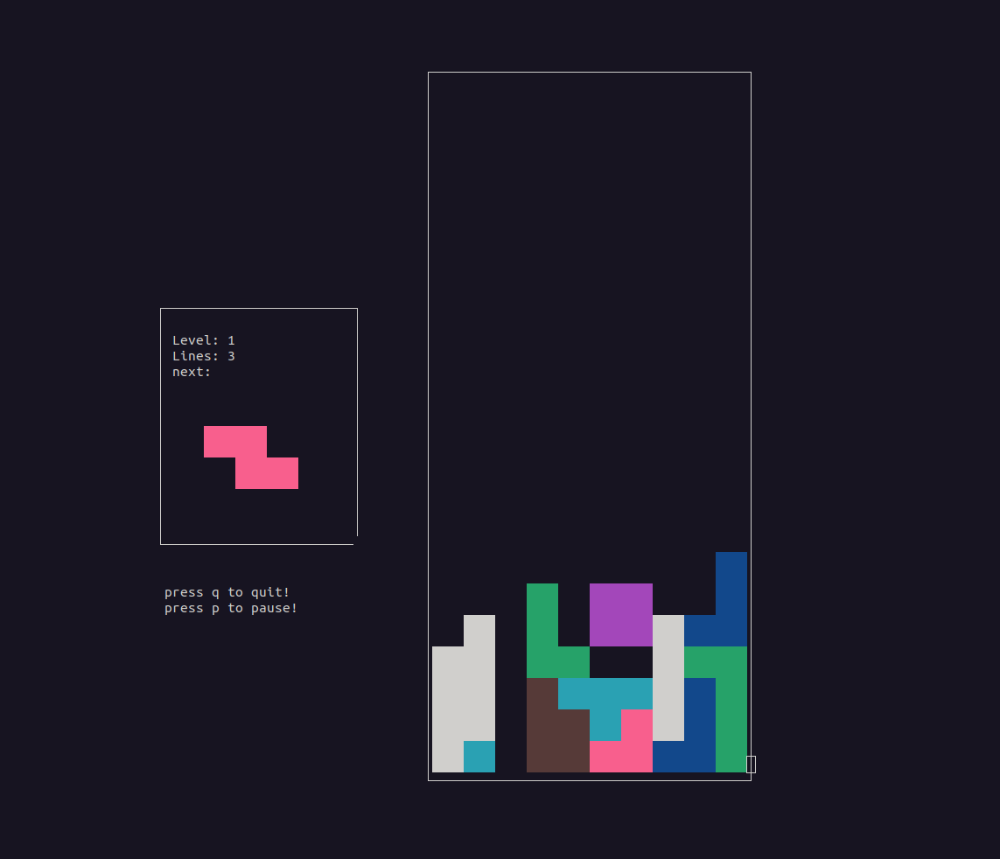

it's a tetris clone, made for linux terminal, 

it's programmed in C langage.

It's very basic.

few ncurses bugs stays when resizing the terminal.
The terminal must be quite big in order this tetris to run!

install ncurses hearder files and run

make

then run 

./Tetris

and enjoy
